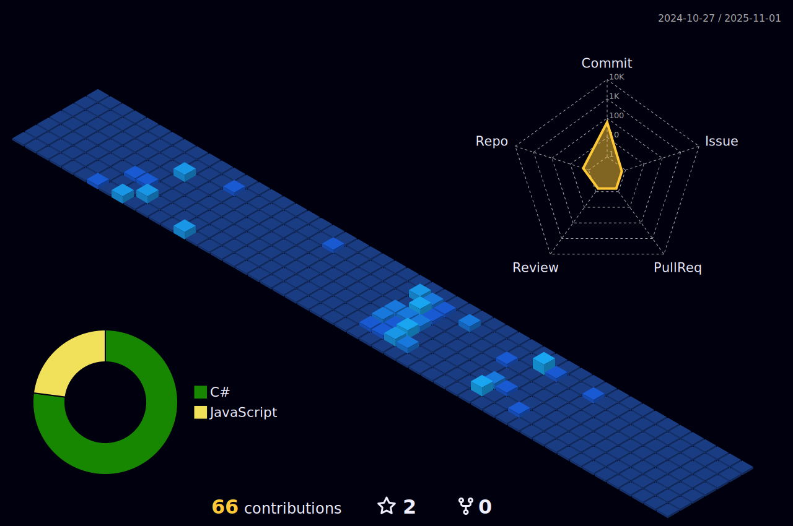

  

###

  

###

<!--    -->

###

<h1 align="center">Hey there 👋</h1>

###

###

<h3 align="left">👩‍💻  About Me</h3>

###

I'm Mohamed Rizwan S   - 🔭 I’m currently pursuing my Bachelors degree in Engineering - 📚 I'm currently developing myself in the field of fullstack - ⚡ In my free time I used to study new technologies

###

<h3 align="left">🛠 Language and tools</h3>

###

  

###

<h3 align="left">🔥   My Stats :</h3>

###

 
 

###
