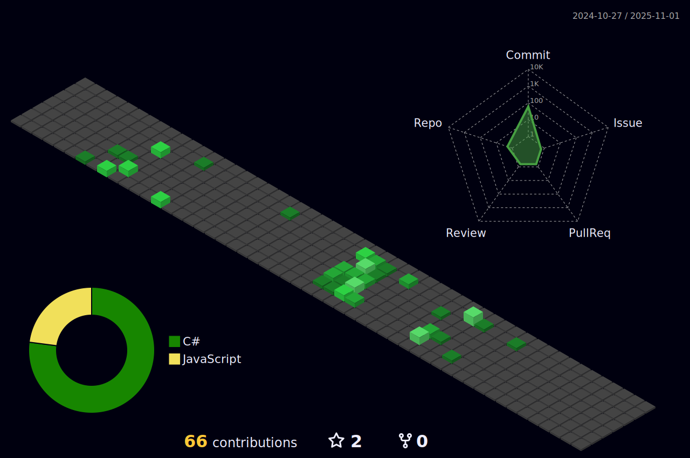

###

###

###

<h1 align="center">Hi 👋, I'm Mohamed Rizwan S</h1>
<h3 align="center">A passionate Full Stack developer</h3>

###

###

<h3 align="left">👩‍💻  About Me</h3>

###

I'm Mohamed Rizwan S   - 🔭 I’m currently pursuing my Bachelors degree in Engineering - ⚡ Programming enthusiast upskilling myself with new technologies -📚 What do I believe? Jack of all, Master of some. -Checkout My <a href="https://mohamedrizwan.vercel.app">Portfiolio</a>

###

<h3 align="left"> 🛠 Languages and Tools:</h3>

                         

###

<h3 align="center">🔥   My Stats :</h3>

###

<!--
  -->

 

<!---->

<h3 align="left">🚀 Checkout my Projects </h3>

 - <a href="https://chat-app-q5tc.onrender.com">Chit Chat:</a> Chat Application - <a href="https://lambdabackend.onrender.com">Lambda:</a> E-Commerce Website -<a href="https://tic-tac-toe-xi-mauve.vercel.app">Game: </a>Tic Tac Toe

<h3 align="left">🤝 Connect with me:</h3>

<!--   -->

<!-- 

### -->
